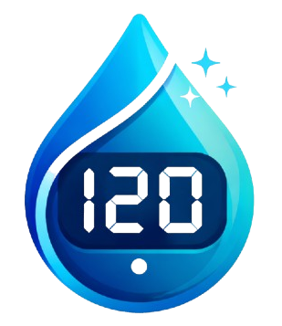

<div align="center">
  
  <h1>GlucoTrack</h1>
  <p><strong>Intelligent Diabetes Monitoring & Clinical Analytics</strong></p>

  <p>
    
    
    
    
    
  </p>

  <h4>A high-performance Progressive Web App (PWA) built for seamless medical tracking, professional reporting, and AI-driven insights.</h4>
</div>

---

## 💎 Project Overview

**GlucoTrack** is a state-of-the-art health platform designed to simplify the daily management of diabetes. Developed with a **mobile-first** philosophy, it combines a premium **medical-dark aesthetic** with advanced clinical tools to provide users and healthcare providers with a comprehensive overview of metabolic health.

### 🚀 Key Value Propositions
- **Frictionless Logging**: Rapid data entry and AI-enhanced recognition to reduce the burden of manual tracking.
- **Clinical-Grade Reporting**: High-fidelity PDF generation with professional metrics like Estimated A1C and Time in Range (TIR).
- **Universal Accessibility**: Full multi-language support (English, French, Arabic) with native RTL layout implementation.
- **Premium User Experience**: Butter-smooth micro-interactions, custom loading orchestration, and a tailored "Cyber-Dark" design system.

---

## ✨ Featured Capabilities

### 🗠 Professional Dashboard
- **Metabolic Trends**: Interactive charts showing glucose fluctuations over time.
- **Time in Range (TIR)**: Visual donut charts displaying the percentage of time spent within target zones.
- **Instant Metrics**: Real-time calculation of Average Glucose, Estimated A1C, and variability markers.

### 📄 Advanced PDF Exports
- **Cyber-Dark Aesthetics**: Beautifully designed reports ready for medical consultations.
- **Localization**: Native support for **Arabic RTL** formatting, ensuring global usability.
- **Metabolic Snapshots**: Includes detailed history tables, trend highlights, and target zone analysis.

### 📸 AI & Image Integration
- **Smart Observation**: (Powered by Gemini/OpenAI) Extract numerical data from glucose meter photos automatically.
- **Live Camera**: Integrated WebRTC camera featuring a medical-style animated viewfinder for instant captures.

### 📱 PWA Excellence
- **Installable**: Full Progressive Web App support for a native feel on iOS, Android, and Windows.
- **Performance**: Optimized with Next.js Turbopack for near-instant load times and 60fps animations.

---

## 🛠 Modern Tech Architecture

- **Frontend**: [Next.js 15 (App Router)](https://nextjs.org/) with React 19.
- **Styling**: [Tailwind CSS v4](https://tailwindcss.com/) using a custom CSS-variable-based medical theme.
- **Authentication**: [Clerk](https://clerk.com/) with enterprise-grade security and custom dark-themed components.
- **Database / API**: [Supabase](https://supabase.com/) for real-time data persistence and secure user policies.
- **Animations**: [Framer Motion](https://framer.com/motion) for route transitions and interactive UI elements.
- **PDF Core**: [@react-pdf/renderer](https://react-pdf.org/) for high-precision document generation.

---

## 📂 Directory Roadmap

```text
src/
├── app/                  # Application Logic (App Router)
│   ├── api/              # AI Insights & Recognition Endpoints
│   ├── auth/             # Modern Authentication Flows
│   ├── dashboard/        # Clinical Analytics & Metrics
│   ├── upload/           # Intelligent Data Capture Interface
│   └── globals.css       # Tailwind v4 & Medical Design System
├── components/           # Modular & Atomic UI Components
│   ├── InitialLoader.tsx # Premium Splash Screen Orchestrator
│   ├── ReportPDF.tsx     # High-Fidelity PDF Templates
│   └── Layout.tsx        # Global Glassmorphism Wrapper
├── lib/                  # Framework Agnostic Logic (i18n, API clients)
├── hooks/                # Specialized State Management
└── types/                # Robust Domain-Driven Type Definitions
```

---

## 🎨 Professional Design System

GlucoTrack utilizes a curated **Medical Dark Palette** designed for clarity and reduced eye strain:
- **Medical Black** (`#050a0f`): The primary obsidian surface.
- **Medical Cyan** (`#06b6d4`): Core branding and actionable highlights.
- **Target Green** (`#10B981`): Optimal metabolic states.
- **Danger Red** (`#EF4444`): Hyperglycemic warnings.

---

## 🚀 Deployment & Installation

### Requirements
- Node.js `^20`
- API Keys for Clerk, Supabase, and Gemini AI.

### Local Development
1. **Clone & Install**:
   ```bash
   git clone [repository-url]
   cd glucotrack
   npm install
   ```

2. **Environment Configuration**: Create a `.env.local` based on the project's requirements.

3. **Run Dev Server**:
   ```bash
   npm run dev
   ```

---

## 🛡 License & Privacy

This project is licensed under the MIT License. GlucoTrack is built with privacy-first principles, leveraging Supabase Row-Level Security (RLS) to ensure user data remains strictly isolated and secure.

---
<div align="center">
  <p><i>Empowering metabolic health through intelligent design.</i></p>
</div>
